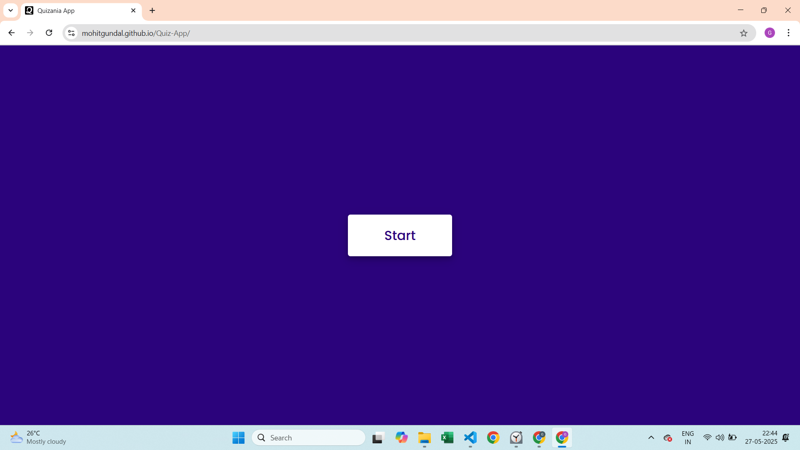
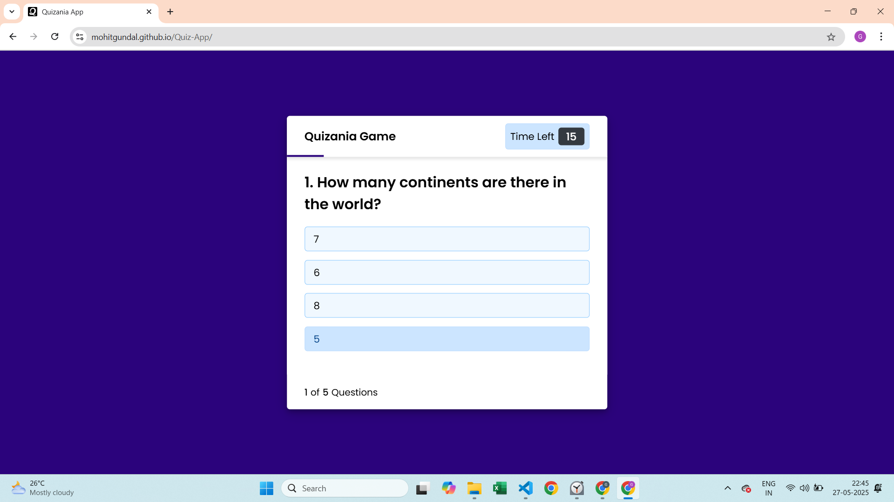
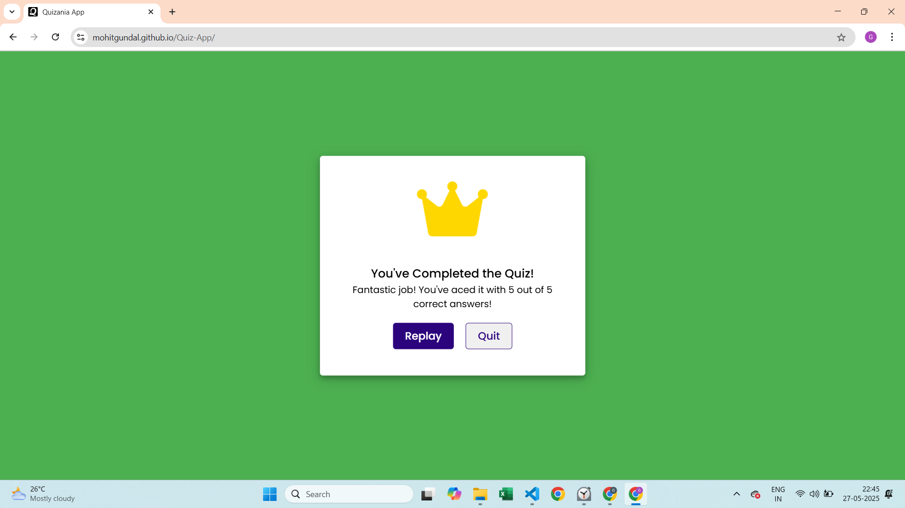
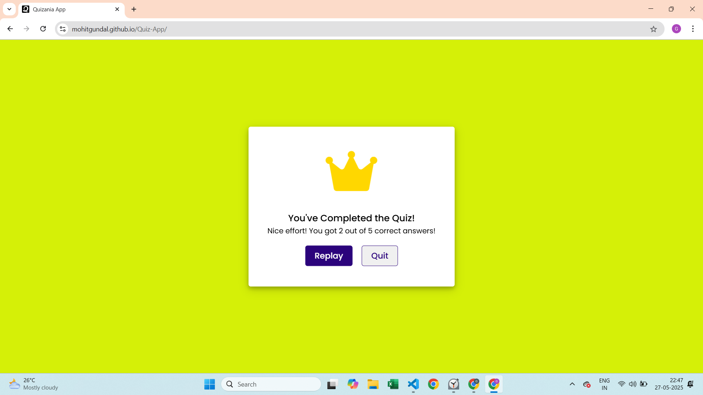
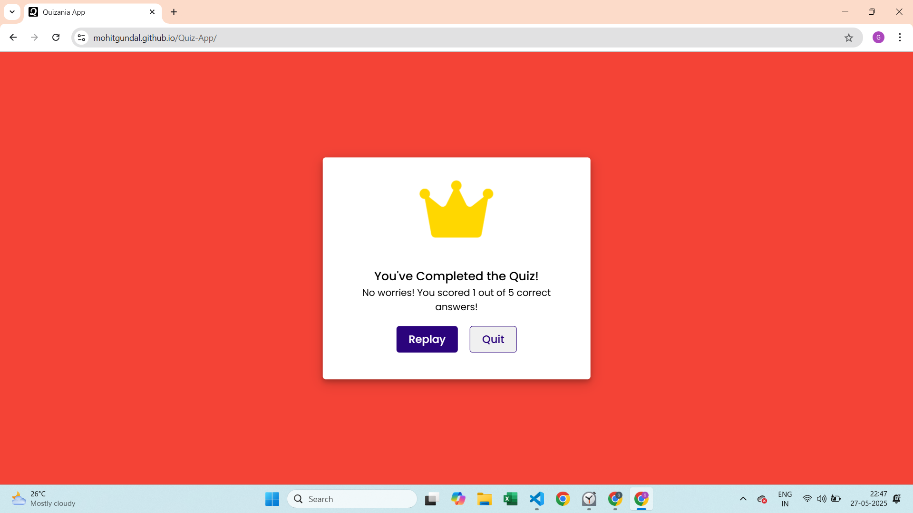

# 🧠 Quizania - Interactive Web Quiz


**Quizania** is a fun and interactive general knowledge quiz built with **HTML**, **CSS**, and **JavaScript**.  
It challenges users with multiple-choice questions, real-time feedback, a countdown timer, and an animated result screen with performance-based styling.

---

## 🚀 Features
- 📱 Clean & responsive design
- 📋 Info screen with quiz rules
- ⏳ Countdown timer for each question
- 📊 Progress bar indicator
- ✅ Instant feedback on answer selection
- 📈 Real-time score tracking
- 🔄 Randomized questions & options
- 🎯 Performance-based result screen (with themed backgrounds)
- 🔁 Replay or quit after completion
- 🌟 Custom favicon for brand identity

---

## 🌐 Live Demo

👉 [Play Quizania Online](https://mohitgundal.github.io/Quiz-App)

---

## 📸 Screenshots

## 🟢 Start Screen  


## 🟡 During Quiz  


## 🟣 Score > 3 


## 🟠 Score = 2–3


## 🔴 Score = 1  



---

## 🧰 Tech Stack
* **HTML5:** Provides the foundational structure for the quiz application.
* **CSS3:** Handles all styling, layout, responsive design, and animations for a visually appealing experience.
* **JavaScript (ES6+):** Powers all interactive functionalities, including quiz logic, timer management, DOM manipulation, and dynamic content.
* **Font Awesome:** Utilized for various icons (e.g., checkmark, cross, crown).
* **Google Fonts:** Incorporated for custom typography to enhance readability and aesthetics.

---

## 📁 Folder Structure

```plaintext
Quiz-App/
├── index.html       # Main structure file
├── style.css        # All styles and responsiveness
├── script.js        # Main quiz logic, scoring, timing
├── questions.js     # Question bank (MCQs, options, answers)
├── images/          # Screenshots and assets
├── icon.png         # Custom favicon
└── README.md        # Project documentation
```

## 💻 How to Run Locally

Follow these simple steps to get the Quizania game running on your local machine:

1.  **Clone the repository (or download the files):**
    If you're using Git, open your terminal or command prompt and run:
    ```bash
    git clone https://github.com/mohitgundal/Quiz-App.git
    ```
    
    Alternatively, you can just download the project files directly from GitHub as a ZIP archive.

2.  **Navigate to the project directory:**
    If you cloned the repository, change into the project folder:
    ```bash
    cd Quiz-App
    ```

3.  **Open `index.html`:**
    Locate the `index.html` file within the project directory and open it with your preferred web browser (e.g., Chrome, Firefox, Edge).
    No local server setup is required as this is a front-end only application.
   ---


## 🤝 Contribution
Contributions are welcome!
Feel free to:
-🍴 Fork the repo
-✍️ Improve the app
-📩 Open a pull request
-💡 Suggest new features or file issues

## 📄 License
This project is licensed under the MIT License — see the LICENSE file for details.


🙋‍♂️ Author
Made with ❤️ by Mohit Gundal
Let’s connect:

📫 [LinkedIn](https://www.linkedin.com/in/mohitbuilds/)  
🌐 [mohitbuilds.com](https://mohitbuilds.com)  
📷 [Instagram](https://www.instagram.com/_mohitbuilds/)

---


🙏 Thank You for Checking Out This Project!
If you found it helpful, please ⭐ the repo and share it!
